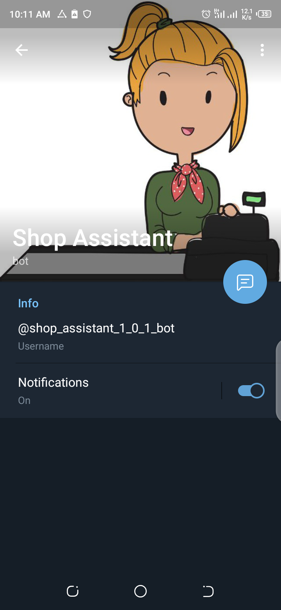
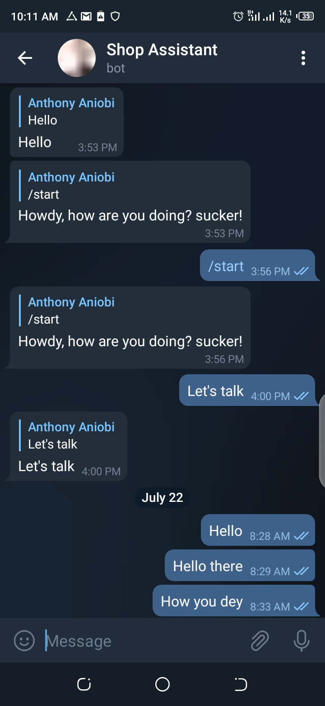

<h1>SHOP ASSISTANT</h1>

This is a telegram bot that serves the purpose of customer care for a retail store. The bot recieves message from the user and then searches through existing entries available and then responding to messages. <b>The bot has the ability to:</b>

<ul>
<li>Take in users requests</li>
<li>Initiate sales</li>
<li>Tackle users complaints</li>
</ul>

<b>Profile image of the image bot</b>

<b>chat screen of the bot</b>
